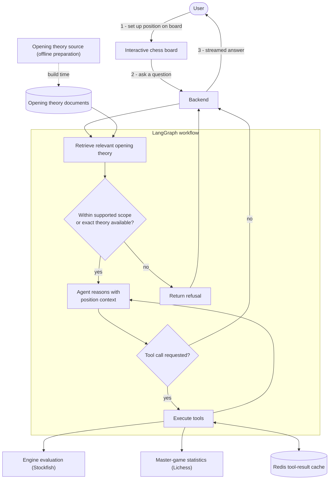

I've been interested in agentic AI, following the developments in that space closely for 2 years now. I am interested in exploring what can be done with LLMs, especially now that the models are becoming very strong. I've also been interested in all the engineering that's needed to get from a proof of concept to a real production system that serves a large number of users.

### Why this, exactly?

I've been interested in chess for a long time, often playing with friends. An important part of the game is knowing what to do at the start of the game, and how to respond to common initial moves of your opponents. These move sequences are called openings.

Studying openings has been increasingly popular among beginners and intermediate players, who see it as a sure way to achieve better results. However, popular ways of studying rely on memorising moves, instead of exploring ideas behind them. I think that this makes players' progress slow, as their game understanding is left less developed.

While LLMs are (understandably) terrible at calculating positions and playing chess in general [1], they likely absorbed great amounts of books and studies on openings during training. Thus, they should be able to provide good advice and carry a discussion on many popular variants, possibly some of those less popular as well.

### Challenge to overcome

It's not enough to just ask an LLM to comment on a chess position, as it will often hallucinate. For example, in one study conducted with a dataset of (position, move) pairs, models were asked to explain the given move in that position. Claude Opus 4.7 (a very strong model) made factual errors in 20.8% of its claims [2]. This refers to simple mistakes, like missing that a piece was on a given square. Not even mentioning quality of judgement or calculation which is another potential obstacle.

### System overview

My solution is centered around a few measures to ground the model's responses or control its scope:
- RAG - retrieving studies of the position in question.
- Tool use - the agent has access to chess engine analysis and a database of master-level games.
- Drawing a line between the opening stage and what comes after.

I'm evaluating the system with a hand-written set of scenarios using both standard, deterministic checks, and an LLM-as-a-judge scheme with custom metrics. The app is containerised. It includes the web user interface with a chessboard and a chat box. I've deployed the app using AWS App Runner, managed by Terraform.

The architecture diagram can be seen below. I will describe most of these elements in more detail in their own sections.

### Grounding the model's responses

#### Retrieval

For setting up RAG, initially I wanted to go with the standard approach of embedding documents into a vector space, then retrieving by similarity. However, I noticed that would probably result in poor retrieval quality. The issue is that chess positions are described with a notation (typically PGN or FEN). In my mind, these condensed strings of letters would be far from enough to create accurate embeddings, putting studies on similar positions close to each other in the space. There is a huge leap an embedding would be asked to make -- from notation to understanding -- and that almost surely would not work.

I came up with a simple way of finding relevant documents that works by exact position match. On one side, we have the position entered by the user. On the other side, we know which position the document refers to. Because of this, we can match the two in order to retrieve documents that are describing the position currently on the board. The figure below illustrates this.

<figure class="article-figure">
  
  <figcaption>Documents are selected by exact position match rather than embedding similarity.</figcaption>
</figure>

There are other concrete advantages to this method - it is simple and cheap - it doesn't require using an embedding model or a vector database.

Sometimes, we may not be able to find a matching document, but a study about a slightly earlier position in the sequence might exist. It's worth retrieving such a study, because it may still contain general ideas for the position that are still relevant, or it might include a short analysis of the exact variant we are in. I suspect this slightly increases the risk of hallucination as the model could become confused. I do make it clear in such cases by appending an explanation to the model context, but it's still worth evaluating the effect of this feature.

If I set out to improve the agent's accuracy, the first thing I would think about is gathering more data for the corpus. I think the retrieval component is core to the system as we are trying to avoid relying on the model's chess understanding.

#### Tool use

The agent has access to the Stockfish chess engine for position analysis. The engine outputs 3 variants along with their numeric evaluation. This helps provide concrete strong suggestions, especially if there's a short tactical sequence the user needs to be aware of. The time budget allocated to the engine is always the same. One value I experimented with was 2 seconds. This somewhat negatively affects user experience (time to first token), but is necessary for providing good analysis.

Another tool is looking up a database of master-level chess games. For this, I am querying the Lichess API. For a given position, this gives us the most popular moves in the position, and how often they were played. Apart from grounding proposed variants, I think it's useful to give that bigger picture as the user might often be interested in what reply they are likely to face from an opponent.

I am defining the tools and binding them to the agent with LangChain.

### Limiting scope

The study referenced in [Challenge to overcome](#challenge-to-overcome) concerns positions from different stages of the game. Limiting ourselves to openings, then, looks promising, as they are way better represented in the training data. However, we need to define a boundary where the opening stage ends and the middlegame begins. The idea is to refuse to answer the user's query if the provided position is not considered an opening. My idea is to classify the position as in-scope if we are able to retrieve at least 1 document describing it, or if the number of moves played is not higher than a chosen value (for example, 8). This is implemented deterministically with a separate LangGraph node that the process gets directed to. In this case, we give the user a hard-coded refusal answer. This matters, as such responses are cheaper and faster - there is no need for a model to step in.

Over the course of a session, the user may change the board position. This might be an issue sometimes, as previous context referencing an earlier position becomes stale. In order to limit complexity, I allow exploration of only one variant in the app - once you make a move, you can't go back and branch into another variant. The user can only extend the existing position by making new moves on top of what's already on the board.

### Evaluation

It's important to track the performance of the system - we want to know if what we've built is even good. Especially if we're going to be adding new features over time.

With regards to evaluation, my thinking is influenced by reading [Hamel Husain](https://hamel.dev/), an expert on LLM evals. He advocates for engaging in the evaluation process more manually - creating hand-written scenarios, reading traces, creating custom metrics - rather than using ready-made approaches or automating the whole process away with LLMs.

Still, the models have their place, so I'm using an LLM-as-a-judge evaluation process on hand-written examples. Each case has a position, a user query, and my reference answer that the judge model can use. Responses are scored on metrics such as correctness or completeness - their meaning is defined in the system prompt I supply to the judge model.
Currently, these are scored on a scale of 1-5, which isn't the best - everybody understands points on this scale differently, and raters might avoid assigning extreme scores. Besides, it takes more cases to establish that two evaluation runs differ in a way that is statistically significant. Binary pass/fail evaluation comes with much clearer interpretation and pass criteria we can define. I am in the process of moving to the binary scale.

I'll share an example of discovering an issue and improving evaluation based on that. After changing the model the app was using, I noticed responses started containing references to the retrieval process (example below). I wanted to hide these internal details from users, but existing evals didn't catch that. So, I added a check to the judge model for this exact issue, used it to ensure I fixed the problem correctly, and the check is now part of the evaluation set for the future.

<figure class="article-quote">
  <blockquote>
    
[...] The retrieved Halloween Gambit document supports 5.d4 as the critical continuation and identifies Black’s retreats as ...Ng6 or ...Nc6. [...]

  </blockquote>
  <figcaption>
    An example agent response exposing internal retrieval details.
  </figcaption>
</figure>

Responses are also scored deterministically for used tools. Each example is assigned a list of tools that are expected to be used for it.

The topic of evaluation is one where I most clearly see the work that still needs to be done. I want to publish the app to get real users - that will give me production traces to analyse, group into patterns, and improve evals based on that, so that they track issues that users are actually experiencing. I believe this has to be done manually - as we engage with real data, we are confronted with a question of what we want the agent to be like, exactly, and refine and document requirements based on that.

### Engineering

I'm using Docker to containerise the application. Having the frontend and backend function independently, I reached for Docker Compose so that it's all bundled together, allowing me to build a container with just one terminal command. I've also included Stockfish installation in creating the container, so the only thing someone cloning the repo would have to do is provide their LLM API key for an appropriate model provider (whose model the system is powered by).

For deployment, I went with AWS App Runner. This way, the cost scales with usage - I don't have to rent a full VM continuously like with EC2. Something like AWS Lambda wouldn't be the right solution, as the app is a bit heavy with dependencies, especially having to install Stockfish.

I'm managing the AWS configuration with Terraform. I view this kind of solution as a must-have - both for clear specification of what configuration the project is supposed to have and for reproducibility. One possibly underrated benefit is also that specifying infrastructure as code plays very nicely with LLMs - they can review and modify it easily, while they generally can't browse through your cloud console.

There is a CI/CD pipeline in place, done with GitHub Actions. CI runs tests, but also enforces codebase standards such as checking formatting. CD runs on every push/merge to the main branch. The setup allows for GitHub to interact with AWS by producing an OIDC token, allowing the session to get short-lived AWS credentials and assume the IAM project role. Then, the app image gets posted to AWS ECR. From that it gets deployed to App Runner.

I've implemented extensive observability to be able to understand app performance and tie it to specific versions of code and prompts. Tracing is done with LangSmith, but I append other relevant information to the trace, such as whether retrieval found any documents, and the Git commit hash. I also include a prompt "bundle" hash - the entire set of variable prompt elements gets bundled and hashed, so I can track whether any prompt elements got changed between runs. Exact prompts can always be retrieved in full, since the commit hash is tracked.

Previously, I mentioned that the chess engine needs substantial time to analyse the position well enough. Because of this, the project uses Redis to cache the tool call results. This way, once a position has been analysed once, another user query for that position can reuse that result. The agent's response can't be cached, though, because it depends on the user's prompt and prior context.

### How my thinking changed

I would like to summarise what I've learned by briefly going over specific choices I've made during the development process.

#### Retrieval method

I'm happy that I put effort into coming up with retrieval that is based on the board-state match, instead of trying to make the embedding approach work. I want to have enough awareness so that I don't default to the popular approach if it's not the right one for the project.

#### Agentic workflow

Initially, there was just a simple agent loop. However, I've come to favor explicit LangGraph workflows for clarity and ease of extension. This approach feels natural to me. I was able to add a separate node in the workflow for handling out-of-scope queries. I plan on adding a loop pattern to retry if a response contains an invalid proposed move sequence. In a graph-based workflow this is very natural to implement.

#### Evaluation score scale

I have to admit that initially, I didn't see any issue with evaluating on a 1-5 scale. Reading Hamel Husain's argument changed my mind in favor of the binary pass/fail approach. Given the pace of AI engineering, there aren't many established voices in the space, so it's nice to know his blog at least.

#### Docker - with Compose or without it?

While I understood well the benefits of containerising the app, at first I was reluctant to use the Compose branch of Docker. I was fine with running the backend and frontend separately, in two terminals. But that was the wrong approach - it's important to reduce friction as much as you can, ideally running something with just one command or one button press.

### Sources

1. Kolasani et al., “[LLM CHESS: Benchmarking Reasoning and Instruction-Following in LLMs through Chess](https://arxiv.org/abs/2512.01992)”, arXiv, 2025.
2. Ashwin Hebbar et al., “[Hallucinations on the Board: Tool-Augmented Evaluation of LLM Chess Commentary](https://arxiv.org/abs/2608.04240)”, arXiv, 2026.